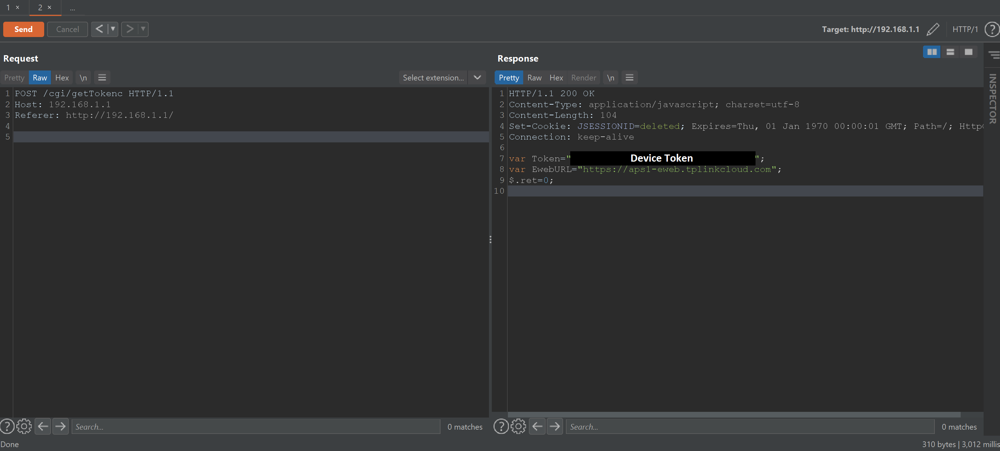
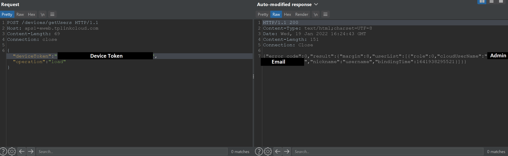
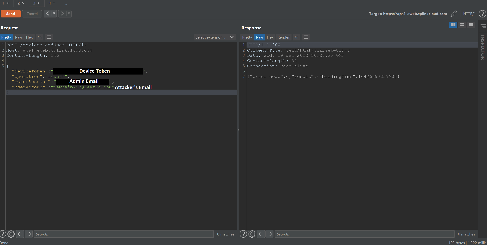
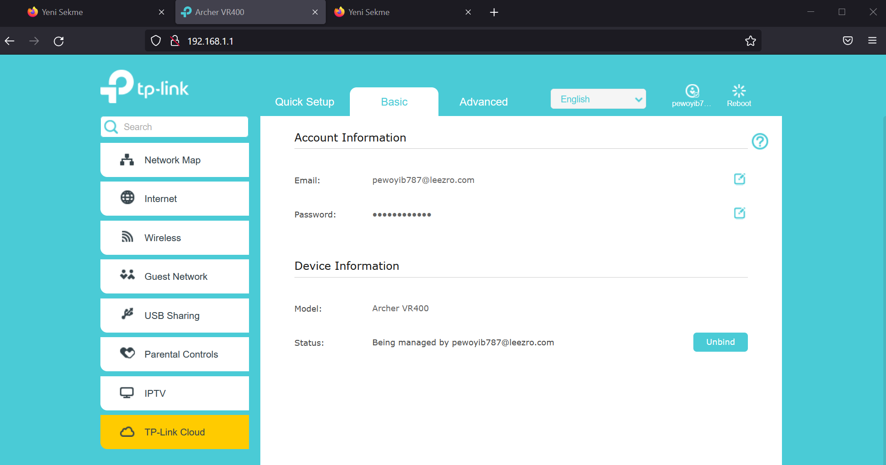

# TPLink Authentication Bypass
TP-Link Cloud API endpoints were lack of authentication mechanizm actually. To add yourself as a user, only thing you need is device token. And any unauthorized user has the ability of getting the device token by requesting to the `/cgi/getTokenc` endpoint of the router.

[Update] 2022-01-11: The vulnerability has been fixed by the tp-link team. Here (`https://static.tp-link.com/upload/beta/2022/202201/20220111/Archer_VR400V2_0.4.0_0.9.1_up_boot(211223)_2021-12-23_21.02.22.zip`) is the newest firmware to fix, for Archer VR400 V2 






## Usage
1) Register to the tplink cloud service over there https://www.tplinkcloud.com/register.php and note the email and password that you registered.
2) Run the command `python3 exploit.py <host> <your_email_address>` by replacing `<host>` and `<your_email_address>`.
3) Now you must be able to login to the device directly with your credentials. Or you can use tplink tether software to control the device remotely.

## Supported/Compatible Devices
Actually tested on **Archer VR400 V2** but **may be** working on other tplink cloud supported devices:
```
Archer A10 V1
Archer A20 V1
Archer A2300 V1
Archer A7 V5
Archer A8 V1
Archer A9 V6
Archer AX10 V1
Archer AX11000 V1
Archer AX1500 V1
Archer AX1800 V1
Archer AX20 V1
Archer AX21 V1
Archer AX3000 V1
Archer AX3200 V1
Archer AX50 V1
Archer AX6000 V1
Archer AX73 V1
Archer AX90 V1
Archer C2300 V1
Archer C2700 V1
Archer C3150 V2
Archer C4000 V2
Archer C5400 V2
Archer C5400X V1
Archer C7 V4
Archer C80 V1
Archer C9 V4
Archer GX90 V1
Archer VR2100 V1
Archer VR2800 V1
Archer VR300 V1
Archer VR400 V2
Archer VR600 V2
Archer VR900 V3
TD-W9960 V1
TD-W9970 V4
```
